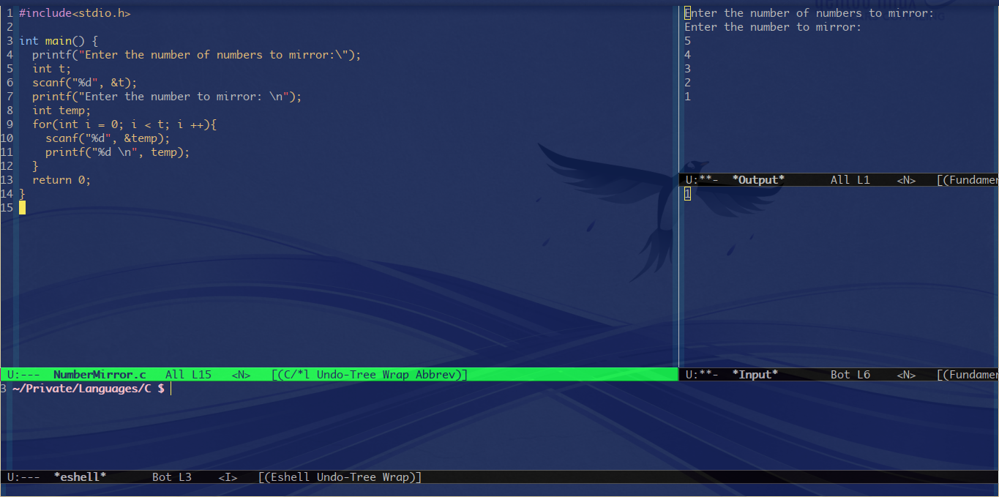

# Table of Contents

1.  [Synopsis](#org7f4aa28)
2.  [Basic Usage](#org9d3d727)
3.  [TO DO](#orgd5499eb)

# Synopsis

Emacs IDE mode is my effort to create a very basic ide which can be useful for everyone. I didn't feel the need to add buffer list and file list as adding those only gives a visual representation consuming space which can otherwise be more efficiently used via emacs built in **find-file** and **ibuffer**. There are two windows specifically dedicated to Input and Output. A shell is provided at the bottom for using developer tools like gdb etc. 

All the Input is internally linked to be passed into the executing program. And all the output of the program is internally sent to the output buffer. So there is a clear dividing line between the input and the output.

# Basic Usage

    (global-set-key (kbd "C-S-i")  'ide)
    (global-set-key (kbd "C-S-i e")  'ide/ide-mode-open)
    (global-set-key (kbd "C-S-i d")  'ide/ide-mode-close)
    (global-set-key (kbd "C-S-i z")  'ide/ide-mode-compile)
    (global-set-key (kbd "C-S-i x")  'ide/ide-mode-execute)

# TO DO

-   [ ] Customizable Execute and Compile Recipes

